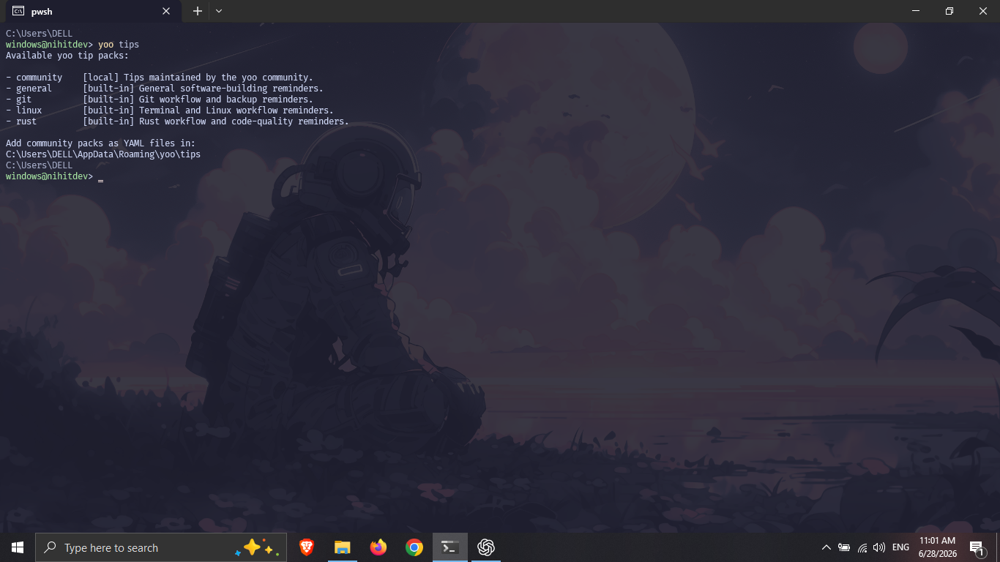
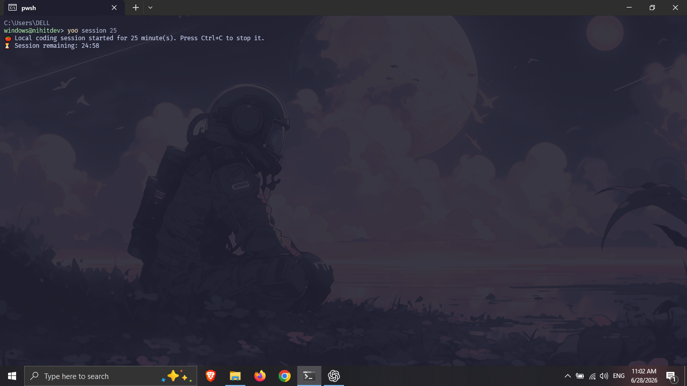

# yoo

<p align="center">
  <strong>A tiny developer companion for better coding sessions.</strong>
</p>

<p align="center">
  Start your session with good vibes, useful project details, environment checks, tip packs, and a local focus timer.
</p>

<p align="center">
  <a href="https://crates.io/crates/yoo">
    
  </a>
  <a href="https://crates.io/crates/yoo">
    
  </a>
  <a href="https://github.com/nihitdev/yo-cli/actions/workflows/ci.yml">
    
  </a>
  <a href="LICENSE">
    
  </a>
</p>

<p align="center">
  
</p>

## What is yoo?

`yoo` is a Rust CLI that makes opening a terminal feel a little better.

It gives you a friendly developer-session greeting, shows the current project and Git state, offers practical tips, checks your Rust setup, and includes a lightweight local coding-session timer.

```text
Terminal open. Brain online. Let's go, Nihit. ⚡

📁 Project: yo-cli
🌿 Git branch: main
✏️ Working tree: clean

💡 Tip: Write the test that would have caught your last bug.
```

## Features

* 🚀 Friendly developer session starter
* 🩺 `yoo doctor` for Rust, Cargo, Git, config, and project checks
* ⏱️ Local coding-session timer with `yoo session`
* 📝 YAML configuration
* 💡 Built-in and community YAML tip packs
* 🌿 Current Git branch and working-tree status
* 🎨 Nine terminal themes
* 🦀 Written in Rust
* ✅ Unit tests, formatting checks, Clippy, and GitHub Actions CI

## Screenshots

### Start a coding session

```bash
yoo --fast --name Nihit
```

<p align="center">
  
</p>

### Check your setup

```bash
yoo doctor
```

<p align="center">
  
</p>

### Discover tip packs

```bash
yoo tips
```

<p align="center">
  
</p>

### Start a focus session

```bash
yoo session 25
```

<p align="center">
  
</p>

## Install

Install from crates.io:

```bash
cargo install yoo
```

Then start a session:

```bash
yoo
```

To update later:

```bash
cargo install yoo --force
```

## Commands

```text
yoo
yoo doctor
yoo init
yoo config
yoo tips
yoo tip rust
yoo tip git
yoo session
yoo session 25
```

## Useful Options

```bash
yoo --fast
yoo --name Nihit
yoo --theme tokyo-night
yoo --plain
yoo --no-art
```

## Themes

```text
neon
ocean
mono
dracula
tokyo-night
gruvbox
nord
rose-pine
catppuccin
```

Example:

```bash
yoo --fast --theme tokyo-night
```

## Configuration

Create the default YAML configuration and a sample community tip pack:

```bash
yoo init
```

Config locations:

```text
Windows: %APPDATA%\yoo\config.yaml
Linux:   ~/.config/yoo/config.yaml
macOS:   ~/Library/Application Support/yoo/config.yaml
```

Example configuration:

```yaml
version: 1

profile:
  name: Nihit

appearance:
  theme: tokyo-night
  ascii: true
  colors: true
  typing_speed_ms: 12

git:
  show_branch: true
  show_status: true

tips:
  enabled: true
  pack: rust

hydration:
  enabled: true

session:
  default_minutes: 25
  show_complete_message: true
```

Print the active config path:

```bash
yoo config
```

## Tip Packs

`yoo` ships with these built-in tip packs:

```text
general
git
linux
rust
```

Get one random Rust tip:

```bash
yoo tip rust
```

Community packs are YAML files stored here:

```text
Windows: %APPDATA%\yoo\tips
Linux:   ~/.config/yoo/tips
macOS:   ~/Library/Application Support/yoo/tips
```

Example community tip pack:

```yaml
name: web
description: Web-development reminders.

tips:
  - Test loading, error, and empty states.
  - Check the browser console before guessing.
  - Never expose secrets in frontend code.
```

Save it as `web.yaml`, then run:

```bash
yoo tip web
```

## Development

```bash
git clone https://github.com/nihitdev/yo-cli.git
cd yo-cli

cargo fmt
cargo test
cargo clippy -- -D warnings

cargo run -- doctor
cargo run -- --fast --name Nihit
```

## Quality Checks

Before pushing changes:

```bash
cargo fmt --check
cargo test
cargo clippy -- -D warnings
```

## Roadmap

* [x] Developer session greeting
* [x] Git branch and working-tree summary
* [x] YAML configuration
* [x] Themes
* [x] `yoo doctor`
* [x] Local coding-session timer
* [x] Community YAML tip packs
* [ ] More tip packs from contributors
* [ ] Config editor command
* [ ] Shell completion support
* [ ] Better terminal accessibility options
* [ ] Optional release update checker

## Contributing

Contributions, ideas, tip packs, and bug reports are welcome.

Read [CONTRIBUTING.md](CONTRIBUTING.md) before opening a pull request.

## License

`yoo` is licensed under the GNU General Public License v3.0 or later.

See [LICENSE](LICENSE) for details.

---

Built with ❤️ and Rust by [@nihitdev](https://github.com/nihitdev).
