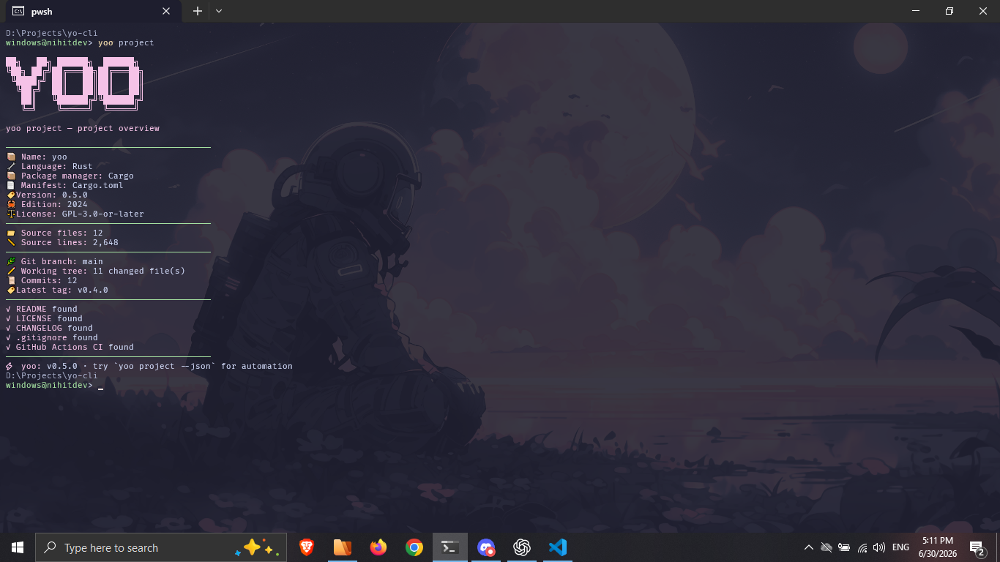

# yoo

<p align="center">
  <strong>Know your project. Check your setup. Start coding.</strong>
</p>

<p align="center">
  <code>yoo</code> is a fast, local-first CLI for starting a development session with the context that matters.
</p>

<p align="center">
  <a href="https://crates.io/crates/yoo"></a>
  <a href="https://www.npmjs.com/package/@nihitde_v/yoo"></a>
  <a href="https://github.com/nihitdev/yo-cli/releases/latest"></a>
</p>

<p align="center">
  <a href="https://github.com/nihitdev/yo-cli/actions/workflows/ci.yml"></a>
  
  <a href="LICENSE"></a>
</p>

<p align="center">
  
</p>

## Why yoo?

Opening a project often means checking the same things again: the active branch, working-tree state, available tools, project type, and repository health.

`yoo` puts that context behind a few memorable commands:

```bash
yoo             # start the session
yoo doctor      # check the setup
yoo project     # inspect the repository
```

It stays intentionally small:

- **Local only:** no telemetry, accounts, network calls, daemon, or AI service
- **Fast:** written in Rust with only three runtime dependencies
- **Useful anywhere:** Windows, Linux, and macOS
- **Scriptable:** clean JSON from `yoo fetch --json` and `yoo project --json`

## Quick start

Install a prebuilt binary:

```bash
cargo binstall yoo
```

Then run:

```bash
yoo --fast
yoo doctor
yoo project
```

No configuration is required. Run `yoo init` only when you want to customize the theme, profile, timer, or tip packs.

## The core workflow

### 1. Start a coding session

```bash
yoo --fast
```

See the current project, Git branch, working-tree state, and one practical reminder without opening an IDE.

<p align="center">
  
</p>

### 2. Check your setup

```bash
yoo doctor
```

Check Rust, Cargo, Git, Rustfmt, Clippy, yoo configuration, project detection, and repository state. Project detection works with Rust, Node.js, Python, Go, Java, and .NET repositories.

<p align="center">
  
</p>

### 3. Understand the project

```bash
yoo project
```

Get project metadata, package-manager detection, source statistics, Git details, and common repository-file checks.

<p align="center">
  
</p>

### 4. Inspect the environment

```bash
yoo fetch
```

<p align="center">
  
</p>

## Installation

### Prebuilt binary with Cargo Binstall

```bash
cargo binstall yoo
```

If needed, install Cargo Binstall first with `cargo install cargo-binstall`.

### Cargo

```bash
cargo install yoo
```

### npm, pnpm, or Bun

```bash
npm install -g @nihitde_v/yoo
# or: pnpm add -g @nihitde_v/yoo
# or: bun add -g @nihitde_v/yoo
```

The npm wrapper downloads the matching prebuilt binary from GitHub Releases.

### Windows

```powershell
scoop bucket add nihitdev https://github.com/nihitdev/scoop-bucket
scoop install yoo
```

Chocolatey and WinGet packages are awaiting registry review.

### Arch Linux

```bash
yay -S yoo-bin
```

### Build from source

```bash
git clone https://github.com/nihitdev/yo-cli.git
cd yo-cli
cargo install --path .
```

## Commands

| Command | Purpose |
| :-- | :-- |
| `yoo` | Start a developer session |
| `yoo doctor` | Check local tools, configuration, project detection, and Git |
| `yoo project` | Show project metadata, source stats, Git details, and repository files |
| `yoo fetch` | Show the developer environment and current project |
| `yoo status` | Alias for `yoo fetch` |
| `yoo session [MINUTES]` | Start a local focus timer |
| `yoo tip [PACK]` | Print a tip from a built-in or local pack |
| `yoo tips` | List available tip packs |
| `yoo init` | Create the default config and sample tip pack |
| `yoo config` | Print the active config path |
| `yoo help` | Show complete CLI help |

Useful display options:

```bash
yoo --fast
yoo --theme tokyo-night
yoo --plain
yoo --no-art
yoo project --plain
```

## Project detection

| Project type | Marker | Package manager |
| :-- | :-- | :-- |
| Rust | `Cargo.toml` | Cargo |
| Node.js | `package.json` | npm, pnpm, Yarn, or Bun |
| Python | `pyproject.toml` | pip, uv, Poetry, or Pipenv |
| Go | `go.mod` | Go modules |
| Java | `pom.xml` or Gradle files | Maven or Gradle |
| .NET | `.sln` or `.csproj` | .NET SDK |

Generated and dependency directories such as `.git`, `target`, `node_modules`, `dist`, `build`, `.next`, `.venv`, and `vendor` are skipped while counting source files.

## JSON output

Use undecorated JSON in scripts and editor integrations:

```bash
yoo fetch --json
yoo project --json
```

Example project fields:

```json
{
  "yoo_version": "0.6.5",
  "project": {
    "name": "yoo",
    "language": "Rust",
    "version": "0.6.5"
  },
  "git": {
    "branch": "main",
    "changed_files": 0
  }
}
```

Example terminal output:

```text
📦 Name:            yoo
🔧 Language:        Rust
🏷 Version:         0.6.5
```

`--json` cannot be combined with display options such as `--plain`, `--no-art`, or `--theme`.

## Configuration

Create the default YAML file and a sample community tip pack:

```bash
yoo init
yoo config
```

Config locations:

```text
Windows: %APPDATA%\yoo\config.yaml
Linux:   ~/.config/yoo/config.yaml
macOS:   ~/Library/Application Support/yoo/config.yaml
```

The main settings are:

```yaml
profile:
  name: developer

appearance:
  theme: neon
  ascii: true
  colors: true
  typing_speed_ms: 12

git:
  show_branch: true
  show_status: true

tips:
  enabled: true
  pack: general

session:
  default_minutes: 25
  show_complete_message: true
```

Available themes: `neon`, `ocean`, `mono`, `dracula`, `tokyo-night`, `gruvbox`, `nord`, `rose-pine`, and `catppuccin`.

## Tip packs

Built-in packs include `general`, `git`, `linux`, and `rust`.

```bash
yoo tip rust
yoo tips
```

Local packs are simple YAML files stored in the `tips` directory beside the yoo config:

```yaml
name: team
description: Team workflow reminders.
tips:
  - Keep pull requests small enough to review carefully.
  - Write down the command that fixed the problem.
```

## Privacy

`yoo` reads local environment, project, and Git information and prints it to the terminal or requested JSON output. It does not transmit or retain project data.

## Development

```bash
git clone https://github.com/nihitdev/yo-cli.git
cd yo-cli
cargo fmt --check
cargo test --locked
cargo clippy --locked -- -D warnings
cargo build --release --locked
```

Contributions should stay focused and keep yoo lightweight. See [CONTRIBUTING.md](CONTRIBUTING.md).

## Troubleshooting

| Problem | What to try |
| :-- | :-- |
| Missing config warning | Run `yoo init`; defaults already work without a config file |
| No colours | Check whether output is redirected or use a terminal with ANSI support |
| Missing Git information | Run yoo inside a Git repository and ensure `git` is in `PATH` |
| Slow Cargo installation | Use `cargo binstall yoo` for a prebuilt binary |
| JSON rejects an option | Remove display flags when using `--json` |

## License

GPL-3.0-or-later. See [LICENSE](LICENSE).

---

<p align="center">Built with ❤️ and Rust by <a href="https://github.com/nihitdev">@nihitdev</a></p>
