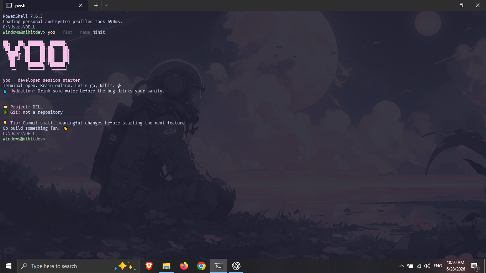
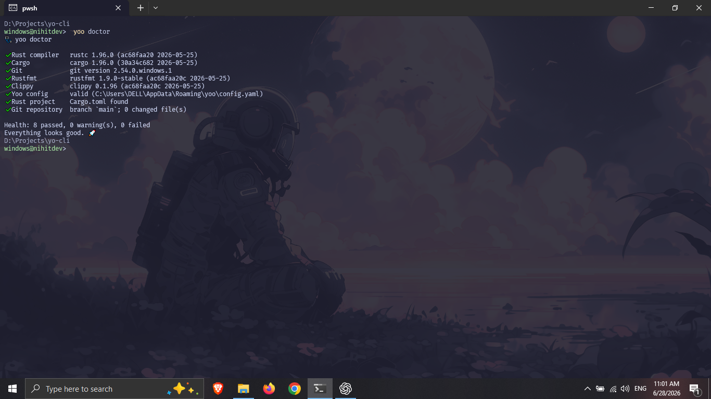
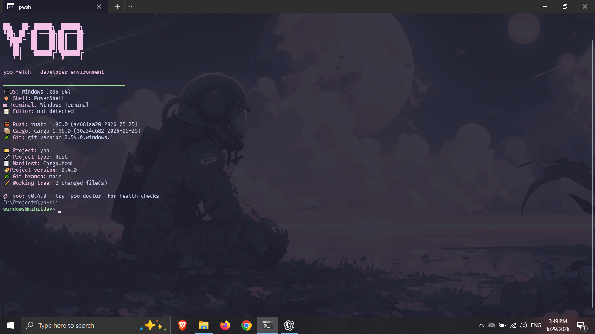

# yoo

<p align="center">
  <strong>A tiny developer companion for better coding sessions.</strong>
</p>

<p align="center">
  Start a session with useful project details, environment checks, tip packs, a focus timer, and a fast project overview.
</p>

<p align="center">
  <a href="https://crates.io/crates/yoo">
    
  </a>
  <a href="https://crates.io/crates/yoo">
    
  </a>
  <a href="https://github.com/nihitdev/scoop-nihitdev">
    
  </a>
  <a href="https://github.com/nihitdev/yo-cli/actions/workflows/ci.yml">
    
  </a>
  <a href="LICENSE">
    
  </a>
</p>

## What is yoo?

`yoo` is a Rust CLI that makes opening a terminal feel a little better.

It gives you a friendly developer-session greeting, shows project and Git state, checks your Rust setup, fetches environment information, analyses the project in the current directory, offers practical tips, and includes a local focus timer.

It is intentionally small: no telemetry, no daemon, no network calls, and no heavy runtime.

```text
Terminal open. Brain online. Let's go. ⚡

📁 Project: yo-cli
🌿 Git branch: main
✏️ Working tree: clean

💡 Tip: Write the test that would have caught your last bug.
```

## Quick start

```bash
cargo install yoo
yoo
yoo doctor
yoo project
```

Use `yoo --fast` when you want the greeting without the typewriter animation.

## Features

- 🚀 Friendly developer session starter
- 🩺 `yoo doctor` for Rust, Cargo, Git, config, and project checks
- ⚡ `yoo fetch` for developer-environment and project detection
- 📦 `yoo project` for project metadata, source stats, Git details, and project-file checks
- 📄 JSON output with `yoo fetch --json` and `yoo project --json`
- ⏱️ Local coding-session timer with `yoo session`
- 📝 YAML configuration
- 💡 Built-in and community YAML tip packs
- 🌿 Current Git branch and working-tree status
- 🎨 Nine terminal themes
- 🦀 Written in Rust
- ✅ Unit tests, formatting checks, Clippy, and GitHub Actions CI

## Why use it?

- Start a coding session with the project name, Git branch, working-tree state, and one useful reminder.
- Check whether Rust, Cargo, Git, Rustfmt, Clippy, config, and repository basics are available.
- Get a quick project report without opening an IDE.
- Feed `yoo fetch --json` or `yoo project --json` into scripts.
- Keep personal and team tips in simple YAML files.

## Screenshots

### Start a coding session

```bash
yoo --fast --name YourName
```

<p align="center">
  
</p>

### Check your setup

```bash
yoo doctor
```

<p align="center">
  
</p>

### Fetch your developer environment

```bash
yoo fetch
```

<p align="center">
  
</p>

### Inspect the current project

```bash
yoo project
```

```text
yoo project — project overview

📦 Name:            yoo
🔧 Language:        Rust
📦 Package manager: Cargo
📄 Manifest:        Cargo.toml
🏷 Version:         0.6.3
🦀 Edition:         2024
⚖ License:          GPL-3.0-or-later

📁 Source files:    10
📏 Source lines:    2,000+
🌿 Git branch:      main
✏️ Working tree:    clean
```

## Installation

Requirements:

- Rust 1.85 or newer for building from source or installing with Cargo
- Git installed if you want repository details in `yoo`, `yoo fetch`, `yoo project`, or `yoo doctor`

### Cargo (cross-platform)

```bash
cargo install yoo
```

Update later:

```bash
cargo install yoo --force
```

### npm (cross-platform binary installer)

```bash
npm install -g @nihitdev/yoo
```

The npm package downloads the matching prebuilt binary from GitHub Releases. It currently supports Windows x64, Linux x64, and macOS arm64.

The npm wrapper package lives in `packages/npm` to keep the repository root focused on the Rust CLI.

### Scoop (Windows)

```powershell
scoop bucket add nihitdev https://github.com/nihitdev/scoop-nihitdev
scoop install yoo
```

Update later:

```powershell
scoop update
yoo --version
scoop update yoo
```

### WinGet (Windows)

The package is being prepared for the official WinGet community repository.

```powershell
winget install --id Nihitdev.Yoo
```

Start your first developer session:

```bash
yoo
```

## Commands

| Command | Purpose |
| :-- | :-- |
| `yoo` | Start the default developer-session greeting |
| `yoo --fast` | Start the greeting without the typewriter delay |
| `yoo doctor` | Check local tooling, config, and repository basics |
| `yoo fetch` | Show OS, shell, editor, Rust/Cargo/Git, project, and Git state |
| `yoo fetch --json` | Print the fetch report as JSON |
| `yoo status` | Alias for `yoo fetch` |
| `yoo project` | Show project metadata, source stats, Git details, and project-file checks |
| `yoo project --json` | Print the project report as JSON |
| `yoo session` | Start the configured focus timer |
| `yoo session 25` | Start a 25-minute focus timer |
| `yoo tip rust` | Print one tip from the Rust tip pack |
| `yoo tips` | List built-in and local tip packs |
| `yoo init` | Create the default config and sample community tip pack |
| `yoo config` | Print the active config path |
| `yoo version` | Print the installed version |
| `yoo help` | Print command help |

## Useful options

```bash
yoo --fast
yoo --name YourName
yoo --theme tokyo-night
yoo --plain
yoo --no-art
yoo project --plain
yoo fetch --json
yoo project --json
```

`--json` is intentionally decoration-free and cannot be combined with display options such as `--plain`, `--no-art`, or `--theme`.

## Themes

```text
neon
ocean
mono
dracula
tokyo-night
gruvbox
nord
rose-pine
catppuccin
```

Example:

```bash
yoo --fast --theme tokyo-night
```

## Project detection

`yoo project` and `yoo fetch` detect these project markers:

| Project type | Marker | Package-manager detection |
| :-- | :-- | :-- |
| Rust | `Cargo.toml` | Cargo |
| Node.js | `package.json` | npm, pnpm, Yarn, or Bun |
| Python | `pyproject.toml` | pip, uv, Poetry, or Pipenv |
| Go | `go.mod` | Go modules |
| Java | `pom.xml` or Gradle files | Maven or Gradle |
| .NET | `.sln` or `.csproj` | .NET SDK |

`yoo project` counts source files and lines while skipping generated or heavy folders such as `.git`, `target`, `node_modules`, `dist`, `build`, `.next`, `.venv`, and `vendor`.

## JSON output

Use JSON output when scripting or feeding project information into another tool:

```bash
yoo fetch --json
yoo project --json
```

Example fields include:

```json
{
  "yoo_version": "0.6.3",
  "project": {
    "name": "yoo",
    "language": "Rust",
    "version": "0.6.3"
  },
  "git": {
    "branch": "main",
    "changed_files": 0
  }
}
```

The exact report includes more fields, but it stays focused on local environment, project, source, and Git data.

## Privacy

`yoo` runs locally. It does not use AI services, collect telemetry, run a background service, or send project data anywhere. Environment and project information stays on your machine and is written only to the requested terminal or JSON output.

## Configuration

Create the default YAML configuration and a sample community tip pack:

```bash
yoo init
```

Config locations:

```text
Windows: %APPDATA%\yoo\config.yaml
Linux:   ~/.config/yoo/config.yaml
macOS:   ~/Library/Application Support/yoo/config.yaml
```

Print the active config path:

```bash
yoo config
```

Default config:

```yaml
version: 1

profile:
  name: developer

appearance:
  theme: neon
  ascii: true
  colors: true
  typing_speed_ms: 12

git:
  show_branch: true
  show_status: true

tips:
  enabled: true
  pack: general

hydration:
  enabled: true

session:
  default_minutes: 25
  show_complete_message: true
```

## Tip packs

`yoo` ships with these built-in tip packs:

```text
general
git
linux
rust
```

Get one random Rust tip:

```bash
yoo tip rust
```

Community packs are YAML files stored here:

```text
Windows: %APPDATA%\yoo\tips
Linux:   ~/.config/yoo/tips
macOS:   ~/Library/Application Support/yoo/tips
```

Example local tip pack:

```yaml
name: team
description: Team workflow reminders.
tips:
  - Keep pull requests small enough to review carefully.
  - Write down the command that fixed the problem.
```

Then run:

```bash
yoo tip team
```

## Troubleshooting

| Problem | What to try |
| :-- | :-- |
| `yoo doctor` says config is missing | Run `yoo init`; defaults are still used until then |
| No colours appear | Check whether output is redirected, or use a terminal that supports ANSI colours |
| Git branch is missing | Run the command inside a Git repository and make sure `git` is in `PATH` |
| `cargo install yoo` fails | Update Rust with `rustup update`, then retry |
| JSON command rejects display flags | Remove `--plain`, `--no-art`, or `--theme` when using `--json` |

## Development

```bash
git clone https://github.com/nihitdev/yo-cli.git
cd yo-cli

cargo fmt --check
cargo test
cargo clippy -- -D warnings
cargo build --release

cargo run -- doctor
cargo run -- fetch
cargo run -- project
cargo run -- project --json
```

Release checks used by this repo:

```bash
cargo fmt --check
cargo test --locked
cargo clippy --locked -- -D warnings
cargo build --release --locked
```

## Roadmap

- [x] Developer session greeting
- [x] Git branch and working-tree summary
- [x] YAML configuration
- [x] Themes
- [x] `yoo doctor`
- [x] Local coding-session timer
- [x] Community YAML tip packs
- [x] `yoo fetch` developer environment and project status
- [x] `yoo project` project overview and source stats
- [x] JSON output for `yoo fetch` and `yoo project`
- [x] Automated cross-platform GitHub releases
- [ ] More tip packs from contributors
- [ ] Shell completion support
- [ ] Better terminal accessibility options

## Contributing

Contributions, ideas, tip packs, and bug reports are welcome.

Read [CONTRIBUTING.md](CONTRIBUTING.md) before opening a pull request.

## License

`yoo` is licensed under the GNU General Public License v3.0 or later.

See [LICENSE](LICENSE) for details.

---

Built with ❤️ and Rust by [@nihitdev](https://github.com/nihitdev).
