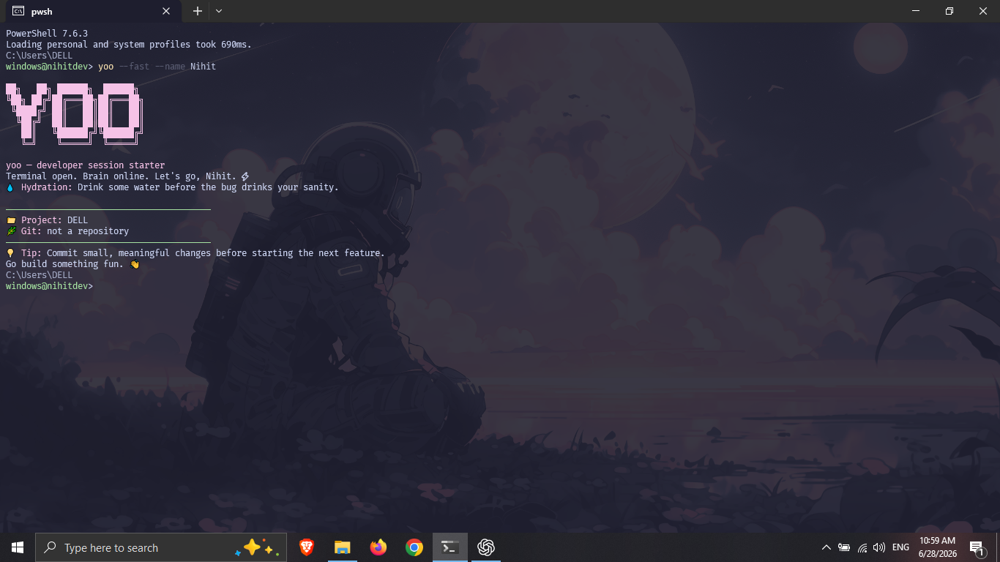
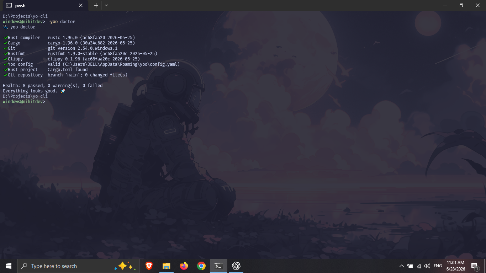
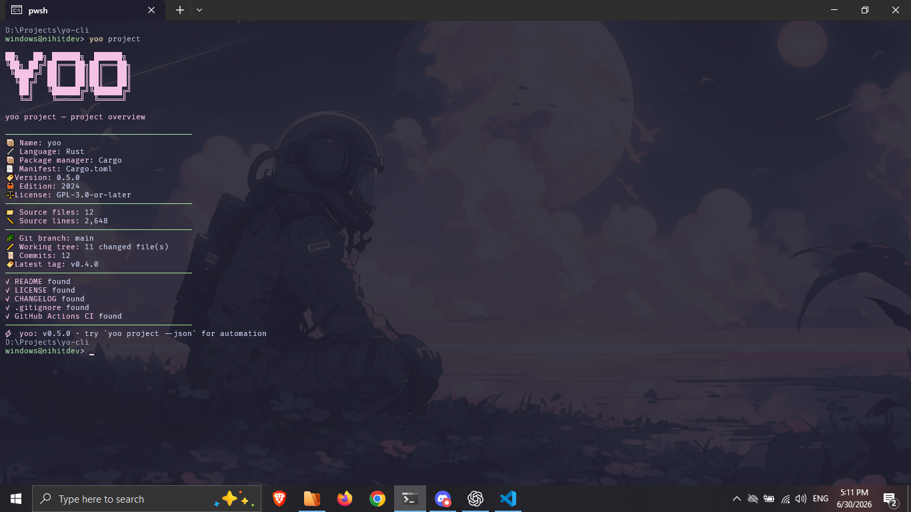
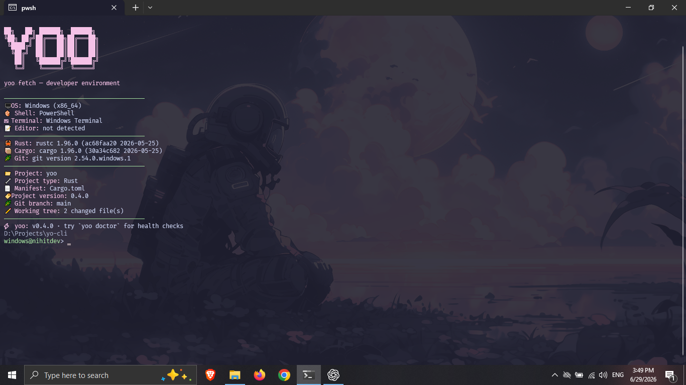
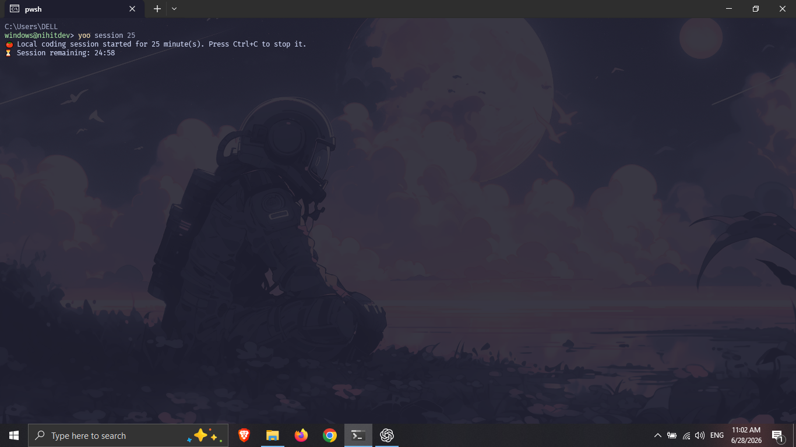
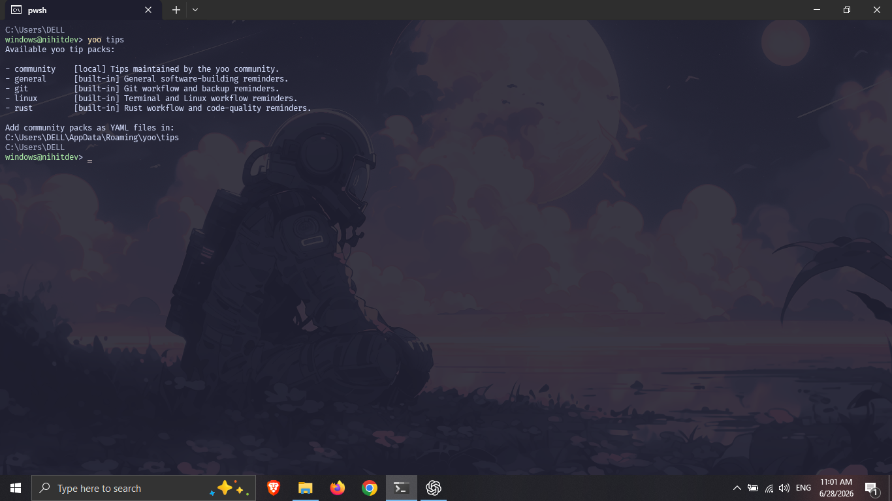
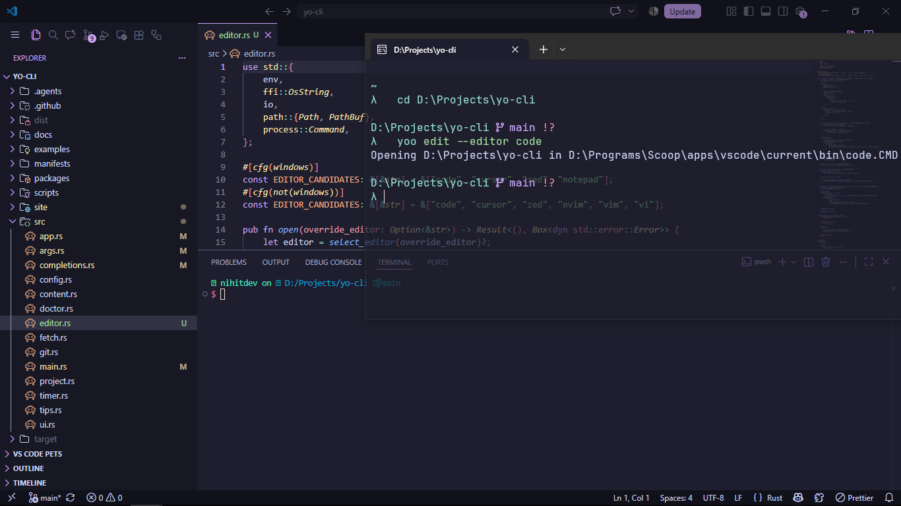

# yoo

<p align="center">
  A small, local-first CLI for viewing project, Git, and development environment information.
</p>

<p align="center">
  🌐 <strong><a href="https://yo-cli.vercel.app">Website</a></strong>
  &nbsp;·&nbsp;
  📚 <strong><a href="docs/README.md">Documentation</a></strong>
</p>

<p align="center">
  <a href="https://crates.io/crates/yoo"></a>
  <a href="https://www.npmjs.com/package/@nihitde_v/yoo"></a>
  <a href="https://github.com/nihitdev/yo-cli/releases/latest"></a>
</p>

<p align="center">
  <a href="https://github.com/nihitdev/yo-cli/actions/workflows/ci.yml"></a>
  
  <a href="LICENSE"></a>
</p>

## Overview

`yoo` collects common project and environment checks in a few commands:

```bash
yoo             # show a session summary
yoo doctor      # check development tools and configuration
yoo project     # inspect the current repository
```

The project is:

- local-only, with no telemetry, accounts, daemon, or AI service
- written in Rust
- available on Windows, Linux, and macOS
- usable in scripts through `yoo fetch --json` and `yoo project --json`

## Screenshots

### 1. Start a coding session

```bash
yoo --fast
```

This displays the current project, Git branch, working-tree state, and a configured reminder.

<p align="center">
  
</p>

### 2. Check your setup

```bash
yoo doctor
```

Check Rust, Cargo, Git, Rustfmt, Clippy, yoo configuration, project detection, and repository state. Project detection works with Rust, Node.js, Python, Go, Java, and .NET repositories.

<p align="center">
  
</p>

### 3. Understand the project

```bash
yoo project
```

Get project metadata, package-manager detection, source statistics, Git details, and common repository-file checks.

<p align="center">
  
</p>

### 4. Inspect the environment

```bash
yoo fetch
```

<p align="center">
  
</p>

### 5. Start a local session timer

```bash
yoo session 25
```

<p align="center">
  
</p>

### 6. View installed tip packs

```bash
yoo tips
```

<p align="center">
  
</p>

### 7. Open the current project in your editor

```bash
yoo edit --editor code
```

Use `--editor` to choose an editor explicitly, or run `yoo edit` to use `VISUAL`, `EDITOR`, or an automatically detected editor.

<p align="center">
  
</p>

## Installation

### Installer script

On supported Linux x86-64 and Apple Silicon macOS systems:

```bash
curl --proto '=https' --tlsv1.2 -LsSf \
  https://yo-cli.vercel.app/yo-setup | sh
```

The installer verifies the downloaded binary against the release's published SHA-256 checksum and installs it to `~/.local/bin`. Override the destination with `YOO_INSTALL_DIR` or install a specific release with `YOO_VERSION=1.0.0`.

See the [installation guide](docs/installation.md) for platform details, updates, uninstallation, and installer security options.

### Prebuilt binary with Cargo Binstall

```bash
cargo binstall yoo
```

If needed, install Cargo Binstall first with `cargo install cargo-binstall`.

### Cargo

```bash
cargo install yoo
```

### npm

```bash
npm install -g @nihitde_v/yoo
```

### pnpm

```bash
pnpm add -g @nihitde_v/yoo
```

### Bun

```bash
bun add -g @nihitde_v/yoo
```

These packages download the matching prebuilt binary from GitHub Releases.

### WinGet

```powershell
winget source update
winget install --id Nihitdev.yoo --exact
```

### Scoop

```powershell
scoop bucket add nihitdev https://github.com/nihitdev/scoop-bucket
scoop install yoo
```

The Chocolatey package is awaiting registry review.

### Build from source

```bash
git clone https://github.com/nihitdev/yo-cli.git
cd yo-cli
cargo install --path .
```

## Commands

| Command | Purpose |
| :-- | :-- |
| `yoo` | Start a developer session |
| `yoo doctor` | Check local tools, configuration, project detection, and Git |
| `yoo edit [--editor <EDITOR>]` | Open the current directory in your preferred editor |
| `yoo project` | Show project metadata, source stats, Git details, and repository files |
| `yoo fetch` | Show the developer environment and current project |
| `yoo status` | Alias for `yoo fetch` |
| `yoo session [MINUTES]` | Start a local focus timer |
| `yoo tip [PACK]` | Print a tip from a built-in or local pack |
| `yoo tips` | List available tip packs |
| `yoo completions <SHELL>` | Generate Bash, Zsh, Fish, or PowerShell completions |
| `yoo init` | Create the default config and sample tip pack |
| `yoo config` | Print the active config path |
| `yoo help` | Show complete CLI help |

Useful display options:

```bash
yoo --fast
yoo --theme tokyo-night
yoo --plain
yoo --no-art
yoo project --plain
```

## Shell completions

Generate completions from the installed binary:

```bash
# Bash
mkdir -p ~/.local/share/bash-completion/completions
yoo completions bash > ~/.local/share/bash-completion/completions/yoo

# Zsh
mkdir -p ~/.zfunc
yoo completions zsh > ~/.zfunc/_yoo

# Fish
mkdir -p ~/.config/fish/completions
yoo completions fish > ~/.config/fish/completions/yoo.fish
```

For Zsh, ensure `~/.zfunc` is included in `fpath` before `compinit` runs.

For PowerShell, add this line to your profile:

```powershell
yoo completions powershell | Out-String | Invoke-Expression
```

See the [shell completion guide](docs/completions.md) for persistent setup and troubleshooting on every supported shell.

## Project detection

| Project type | Marker | Package manager |
| :-- | :-- | :-- |
| Rust | `Cargo.toml` | Cargo |
| Node.js | `package.json` | npm, pnpm, Yarn, or Bun |
| Python | `pyproject.toml` | pip, uv, Poetry, or Pipenv |
| Go | `go.mod` | Go modules |
| Java | `pom.xml` or Gradle files | Maven or Gradle |
| .NET | `.sln` or `.csproj` | .NET SDK |

Generated and dependency directories such as `.git`, `target`, `node_modules`, `dist`, `build`, `.next`, `.venv`, and `vendor` are skipped while counting source files.

## JSON output

Use undecorated JSON in scripts and editor integrations:

```bash
yoo fetch --json
yoo project --json
```

Example project fields:

```json
{
  "yoo_version": "1.0.0",
  "project": {
    "name": "yoo",
    "language": "Rust",
    "version": "1.0.0"
  },
  "git": {
    "branch": "main",
    "changed_files": 0
  }
}
```

Example terminal output:

```text
📦 Name:            yoo
🔧 Language:        Rust
🏷 Version:         1.0.0
```

`--json` cannot be combined with display options such as `--plain`, `--no-art`, or `--theme`.

## Configuration

Create the default TOML file and a sample community tip pack:

```bash
yoo init
yoo config
```

Config locations:

```text
Windows: %USERPROFILE%\.config\yoo\config.toml
Linux:   ~/.config/yoo/config.toml
macOS:   ~/Library/Application Support/yoo/config.toml
```

The main settings are:

```toml
[profile]
name = "developer"

[appearance]
theme = "neon"
ascii = true
colors = true
typing_speed_ms = 12

[editor]
# Leave empty to detect an editor automatically.
command = "code"

[git]
show_branch = true
show_status = true

[tips]
enabled = true
pack = "general"

[session]
default_minutes = 25
show_complete_message = true
```

Available themes: `neon`, `ocean`, `mono`, `dracula`, `tokyo-night`, `gruvbox`, `nord`, `rose-pine`, and `catppuccin`.

## Tip packs

Built-in packs include `general`, `git`, `linux`, and `rust`.

```bash
yoo tip rust
yoo tips
```

Local packs are simple YAML files stored in the `tips` directory beside the yoo config:

```yaml
name: team
description: Team workflow reminders.
tips:
  - Keep pull requests small enough to review carefully.
  - Write down the command that fixed the problem.
```

## Privacy

`yoo` reads local environment, project, and Git information and prints it to the terminal or requested JSON output. It does not transmit or retain project data.

## Development

```bash
git clone https://github.com/nihitdev/yo-cli.git
cd yo-cli
cargo fmt --check
cargo test --locked
cargo clippy --locked -- -D warnings
cargo build --release --locked
```

## Contributing

`yoo` is free software released under GPL-3.0-or-later. Source code, development history, and release automation are maintained in this repository.

- Read [CONTRIBUTING.md](CONTRIBUTING.md) before submitting a change.
- Use the [issue tracker](https://github.com/nihitdev/yo-cli/issues) for reproducible bugs and scoped feature proposals.
- Run the formatting, test, and Clippy commands in the Development section before opening a pull request.
- Keep contributions local-first and avoid adding telemetry, accounts, background services, or required network access.

## Troubleshooting

| Problem | What to try |
| :-- | :-- |
| Missing config warning | Run `yoo init`; defaults already work without a config file |
| No colours | Check whether output is redirected or use a terminal with ANSI support |
| Missing Git information | Run yoo inside a Git repository and ensure `git` is in `PATH` |
| Slow Cargo installation | Use `cargo binstall yoo` for a prebuilt binary |
| JSON rejects an option | Remove display flags when using `--json` |

## License

GPL-3.0-or-later. See [LICENSE](LICENSE).
