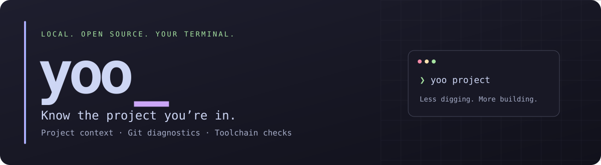
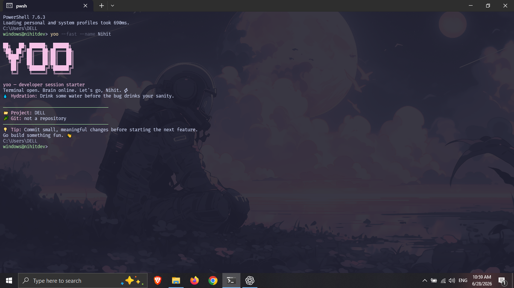
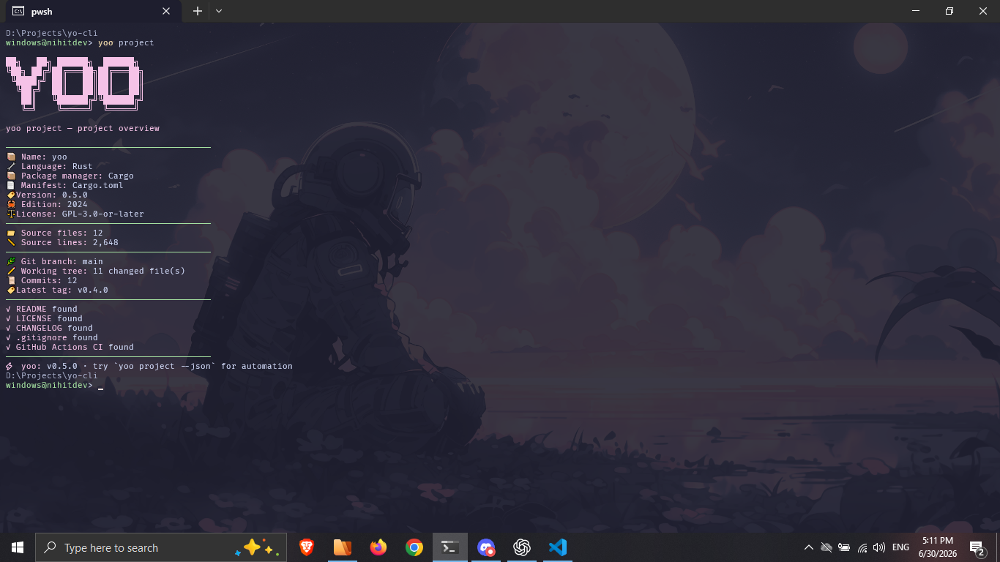
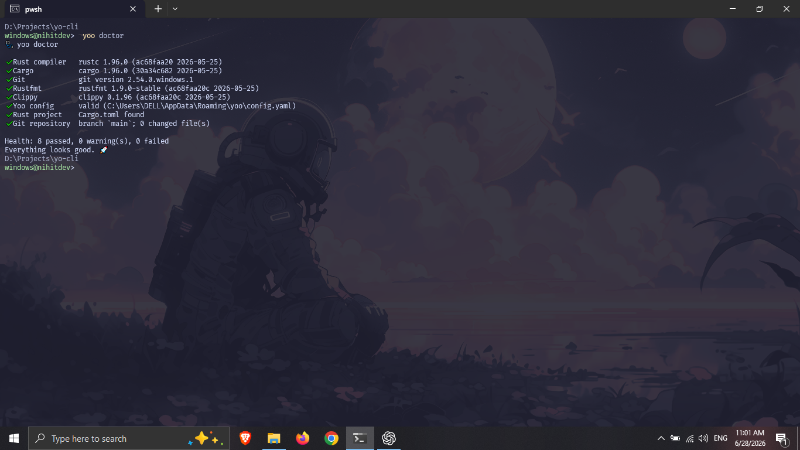

<p align="center">
  
</p>

<p align="center">
  <strong>What the hell is going on with this project?</strong><br />
  Your project, Git state, and dev tools — one command away.
</p>

<p align="center">
  <a href="https://github.com/nihitdev/yo-cli/actions/workflows/ci.yml"></a>
  <a href="https://crates.io/crates/yoo"></a>
  <a href="https://www.npmjs.com/package/@nihit_dev/yoo"></a>
  <a href="LICENSE"></a>
</p>

<p align="center">
  <a href="https://yo-cli.vercel.app"><strong>Website</strong></a> ·
  <a href="#quick-start">Quick start</a> ·
  <a href="docs/README.md">Docs</a> ·
  <a href="https://github.com/nihitdev/yo-cli/releases">Releases</a>
</p>

---

## Your terminal, with context

**Built in Rust. Runs on Linux, macOS, and Windows.** No account, daemon, telemetry, or AI service. Your project data stays on your machine.



| Know where you are | Know what changed | Know what’s missing |
| :--- | :--- | :--- |
| Project type, package manager, source counts, and metadata. | Branch, pending changes, conflicts, and local snapshots. | Toolchain checks that follow the project you’re in. |
| `yoo project` | `yoo snapshot compare --current` | `yoo doctor` |

## Quick start

```bash
cargo install yoo
cd your-project
yoo --fast
```

**No Rust installed?** Use npm:

```bash
npm install -g @nihit_dev/yoo
```

<details>
<summary><strong>More ways to install — script, Homebrew, WinGet, AUR, and more</strong></summary>

### Verified installer

Linux x86-64 and Apple Silicon macOS. Downloads a release binary and checks its SHA-256 checksum.

```bash
curl --proto '=https' --tlsv1.2 -LsSf https://yo-cli.vercel.app/yo-setup | sh
```

| Channel | Command |
| :--- | :--- |
| Homebrew | `brew tap nihitdev/tap` then `brew install yoo` |
| Windows / WinGet | `winget install --id Nihitdev.yoo --exact` |
| Arch / AUR | `yay -S yoo-bin` |
| Cargo Binstall | `cargo binstall yoo` |
| pnpm | `pnpm add -g @nihit_dev/yoo` |
| Bun | `bun add -g @nihit_dev/yoo` |
| Nix | `nix run github:nihitdev/yo-cli` |

**[All installation methods →](docs/installation.md)** — APT, RPM, Alpine, openSUSE, Flatpak, release downloads, supported architectures, updates, and removal.

</details>

## Commands

Start here. Run commands from the directory you want to inspect.

| I want to… | Run |
| :--- | :--- |
| Get oriented | `yoo --fast` |
| Inspect the project | `yoo project` |
| Check my dev setup | `yoo doctor` |
| See my environment | `yoo fetch` |
| Save a point in time | `yoo snapshot` |
| Compare it with now | `yoo snapshot compare --current` |
| Start a focused session | `yoo session 25` |
| Open my editor | `yoo edit` |
| Feed a script | `yoo project --json` |

**[Full command reference →](docs/commands.md)** — flags, snapshot IDs, tips, completions, JSON, and exit codes.

<details>
<summary><strong>See project reports and toolchain checks</strong></summary>

### Project overview



### Doctor



</details>

## Project detection

**13 project types.** Matching tool checks. Source counts that respect ignore rules.

| | | | |
| :--- | :--- | :--- | :--- |
| 🦀 Rust | ⚡ Zig | 🟨 Node.js | 🐍 Python |
| 🐹 Go | ☕ Java | 💎 Ruby | 🐘 PHP |
| 🐦 Swift | 🎯 Dart | 💧 Elixir | ⚙️ C/C++ |
| 🟣 .NET | | | |

Detection uses manifests in the current directory. C/C++ detection uses CMake; Dart includes Flutter projects. In mixed projects, the first matching manifest wins.

**[Markers, precedence, and source-count rules →](docs/project-detection.md)**

## Configuration

```bash
yoo init                         # Create your config
yoo config                       # Print its location
yoo --fast --theme catppuccin     # Try a theme
```

<details>
<summary><strong>Nine themes, your editor, your pace</strong></summary>

**neon · ocean · mono · dracula · tokyo-night · gruvbox · nord · rose-pine · catppuccin**

```toml
[appearance]
theme = "catppuccin"
ascii = true
colors = true

[editor]
command = "code"

[session]
default_minutes = 25
```

Choose a theme, tune the timer, hide the ASCII art, or add your own YAML tip packs.

**[Configuration guide](docs/configuration.md)** · **[Full example](examples/config.toml)** · **[Shell completions](docs/completions.md)**

</details>

## Troubleshooting

Run `yoo doctor` for local diagnostics and `yoo config` to find your configuration. **[Installation help](docs/installation.md)** · **[Git errors and exit codes](docs/commands.md)** · **[Report an issue](https://github.com/nihitdev/yo-cli/issues)**

<details>
<summary><strong>Build from source</strong></summary>

Requires Rust 1.85 or newer. Node.js is only needed for the website and npm wrapper.

```bash
git clone https://github.com/nihitdev/yo-cli.git
cd yo-cli
cargo build --release --locked
cargo test --locked
```

Check your installed version with `yoo --version`:

```text
yoo 1.1.2
```

**[Contributing](CONTRIBUTING.md)** · **[Release guide](docs/releasing.md)** · **[Packaging](packaging/README.md)**

</details>

---

<p align="center">
  Made for the moment you open a repo and wonder where to start.<br /><br />
  <a href="CONTRIBUTING.md">Contribute</a> ·
  <a href="CHANGELOG.md">Changelog</a> ·
  <a href="SECURITY.md">Security</a> ·
  <a href="LICENSE">GPL-3.0-or-later</a>
</p>
